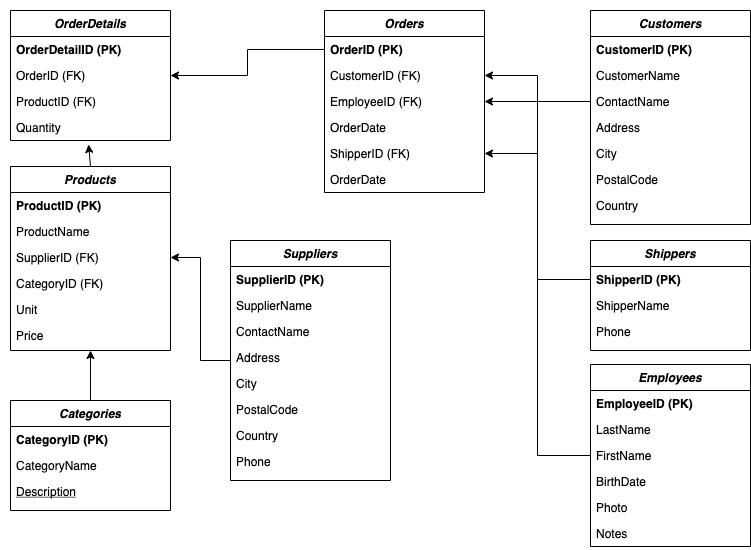

# Modelo Relacional - Delivery

**Este conjunto de datos es puede ser consultado mediante SQL en [w3schools](https://www.w3schools.com/sql/trysql.asp?filename=trysql_op_in)**

El siguiente es un modelo de datos está orientado a un problema donde se coordinan compradores (customers), empresas de delivery (shippers) y proveedores. Estas tablas guardan el registro de las ordenes de compra, clientes, proveedores, empleados que atienden las ordenes, entre otros atributos. Las tablas son las siguientes:

Descripción de variables: TODO