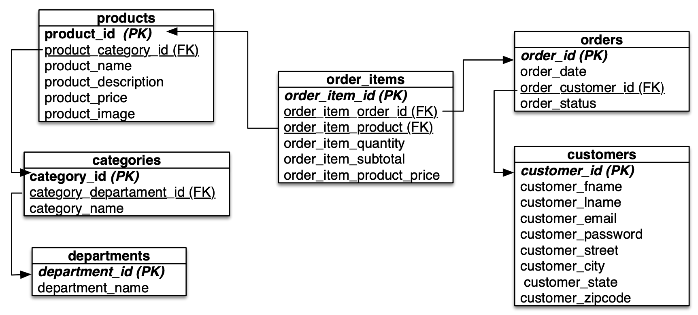

# Modelo Relacional - Retail

**Este modelo y conjunto de datos es utilizado por Carla Vairetti (Universidad de los Andes) en sus talleres.**

El siguiente es un modelo de datos que permite mantener la información para el
correcto funcionamiento de una tienda de retails. Las tablas son las siguientes:

- `departments`: representa los departamentos en los que se divide la empresa de retail. Compuesto por los siguientes atributos:
    * **department_id**: representa la llave primaria (PK), cuyo tipo de dato es un valor entero.
    * **department_name**: representa el nombre del departamento, es de tipo de dato Varchar(200).

- `categories`: representa las categorias que se venden en cada departamento. Compuesto por los siguientes atributos:
    * **category_id**: representa la llave primaria (PK), cuyo tipo de dato es un valor entero.
    * **category_departament_id**: representa la llave foránea (FK) a la tabla `departaments`.
    * **category_name**: nombre de la categoría, es de tipo de dato Varchar(200).

- `products`: representa los productos que se venden en la empresa de retail Compuesto por los siguientes atributos:
    * **product_id**: representa la llave primaria (PK), cuyo tipo de dato es un valor entero.
    * **product_category_id**: representa la llave foránea (FK) a la tabla `categories`.
    * **product_name**: nombre del producto, es de tipo de dato Varchar(45).
    * **product_price**: precio del producto, es de tipo de dato Float.

- `customers`: representa los clientes registrados en la empresa de retail
Compuesto por los siguientes atributos:
    * **customer_id**: representa la llave primaria (PK), cuyo tipo de dato es un valor entero.
    * **customer_fname**: nombre del cliente, es de tipo de dato Varchar(200).
    * **customer_lname**: apellido del cliente, es de tipo de dato Varchar(200).
    * **customer_street**: dirección donde vive el cliente, es de tipo de dato Varchar(255).
    * **custome_city**: cidudad donde vive el cliente, es de tipo de dato Varchar(45).
    * **customer_state**: estado donde vive el cliente, es de tipo de dato Varchar(45).
    * **customer_zipcode**: código postal del cliente, es de tipo de dato Varchar(45).

- `orders`: representa las ordenes de compra que realizan cada cliente de la empresa deretail. Compuesto por los siguientes atributos:
    * **order_id**: representa la llave primaria (PK), cuyo tipo de datos es un valor entero.
    * **order_date**: fecha de venta de la orden de compra, es de tipo de dato Datetime.
    * **order_customer_id**: representa la llave foránea (FK) a la tabla `customers`.
    * **order_status**: estado de la orden de compra, es de tipo de dato Varchar(45).

- `order_items`: representa el detalle da la orden de compra (cada item de producto comprado). Compuesto por los siguientes atributos:
    * **order_item_id**: representa la llave primaria (PK), cuyo tipo de datos es un valor entero. 
    * **order_item_order_id**: representa la llave foránea (FK) a la tabla `orders`.
    * **order_item_product_id**: representa la llave foránea (FK) a la tabla `products`.
    * **order_item_quantity**: cantidad de items a comprar del producto, es de tipo de dato entero.
    * **order_item_subtotal**: monto total por el producto, es de tipo de dato Float.
    * **order_item_product_price**: precio al momento de la compra, es de tipo de dato Float.